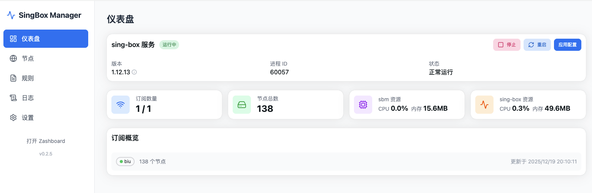
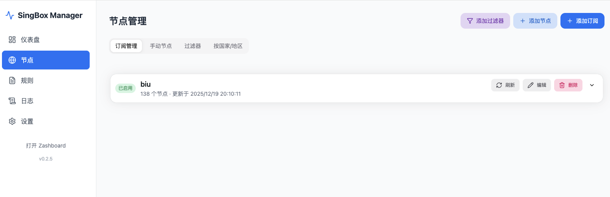
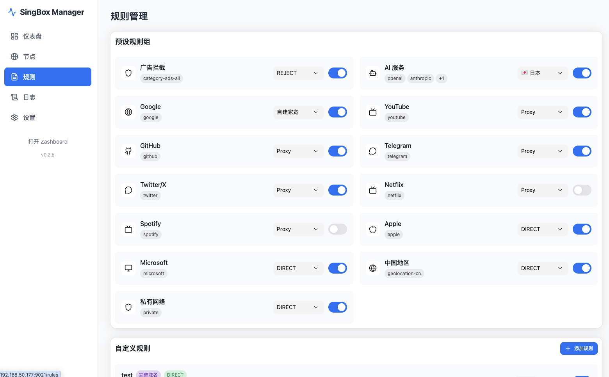
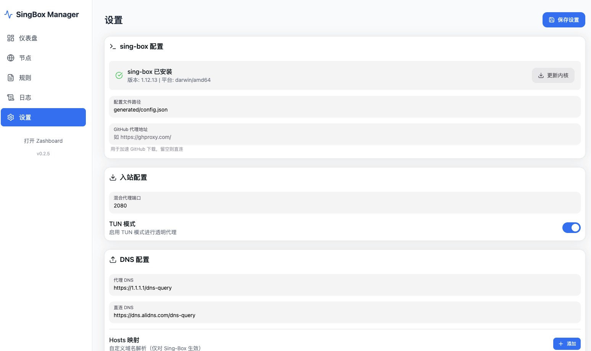
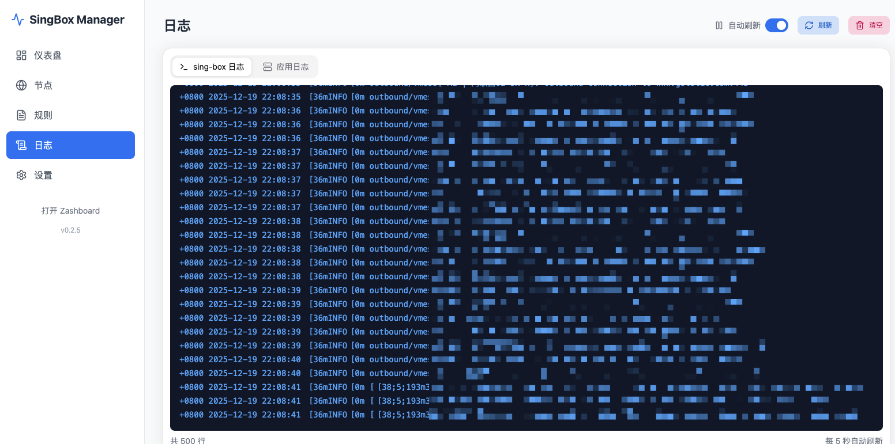

# singbox-manager

A modern web-based management panel for [sing-box](https://github.com/SagerNet/sing-box), providing an intuitive interface to manage subscriptions, rules, filters, and more.

### UI/Logic Roadmap

We maintain a dedicated UI/logic stabilization plan here:

- [UI/Logic Improvement Roadmap](docs/UI_LOGIC_ROADMAP.md)

<details>
<summary>Why this is a separate file</summary>

GitHub does not support true tabbed sections inside `README.md`.  
To keep the main page clean and still make the plan easy to find, the roadmap is linked as a standalone markdown document.

</details>

### Features

- **Subscription Management**
  - Support multiple formats: SS, VMess, VLESS, Trojan, Hysteria2, TUIC
  - Clash YAML and Base64 encoded subscriptions
  - Traffic statistics (used/remaining/total)
  - Expiration date tracking
  - Auto-refresh with configurable intervals

- **Node Management**
  - Auto-parse nodes from subscriptions
  - Manual node addition
  - Country grouping with emoji flags
  - Node filtering by keywords and countries

- **Rule Configuration**
  - Custom rules (domain, IP, port, geosite, geoip)
  - 13 preset rule groups (Ads, AI services, streaming, etc.)
  - Rule priority management
  - Rule set validation tool

- **Filter System**
  - Include/exclude by keywords
  - Country-based filtering
  - Proxy modes: URL-test (auto) / Select (manual)

- **DNS Management**
  - Multiple DNS protocols (UDP, DoT, DoH)
  - Custom hosts mapping
  - DNS routing rules

- **Service Control**
  - Start/Stop/Restart sing-box
  - Configuration hot-reload
  - Auto-apply on config changes
  - Process recovery on startup

- **System Monitoring**
  - Real-time CPU and memory usage
  - Application and sing-box logs
  - Service status dashboard

- **macOS Support**
  - launchd service integration
  - Auto-start on boot
  - Background daemon mode

- **Kernel Management**
  - Auto-download sing-box binary
  - Version checking and updates
  - Multi-platform support

### Screenshots







### Installation

#### Pre-built Binaries

Download from [Releases](https://github.com/pxlvoid/sing-box-manager-gui/releases) page.

#### Build from Source

```bash
# Clone the repository
git clone https://github.com/pxlvoid/sing-box-manager-gui.git
cd singbox-manager

# Build for all platforms
./build.sh all

# Or build for current platform only
./build.sh current

# Output binaries are in ./build/
```

**Build Options:**
```bash
./build.sh all       # Build for all platforms (Linux/macOS x amd64/arm64)
./build.sh linux     # Build for Linux only
./build.sh darwin    # Build for macOS only
./build.sh current   # Build for current platform
./build.sh frontend  # Build frontend only
./build.sh clean     # Clean build directory
```

### Usage

```bash
# Basic usage
./sbm

# Custom data directory and port
./sbm -data ~/.singbox-manager -port 9090
```

**Command Line Options:**
| Option | Default | Description |
|--------|---------|-------------|
| `-data` | `~/.singbox-manager` | Data directory path |
| `-port` | `9090` | Web server port |

After starting, open `http://localhost:9090` in your browser.

### Configuration

**Data Directory Structure:**
```
~/.singbox-manager/
├── data.json           # Configuration data
├── generated/
│   └── config.json     # Generated sing-box config
├── bin/
│   └── sing-box        # sing-box binary
├── logs/
│   ├── sbm.log         # Application logs
│   └── singbox.log     # sing-box logs
└── singbox.pid         # PID file
```

### 🐳 Docker Deployment

Проект содержит готовые `Dockerfile` и `docker-compose.yml`.

```bash
docker compose up -d
```

#### ⚠️ Important: Port Configuration

You must configure ports in **TWO** places:

**1. In Web UI Settings (after first start)**

Open `http://localhost:9090` → Settings → Inbound Configuration:

- SOCKS5 Port: `2080` (enable Authentication if needed)
- HTTP Port: `2081` (enable Authentication if needed)
- Shadowsocks Port: `2388` (set Method and Password)
- Allow LAN: ✅ **MUST BE ENABLED** (otherwise sing-box listens only on 127.0.0.1)
- TUN Mode: ❌ **MUST BE DISABLED** (not supported in Docker without `--privileged`)

**2. In docker-compose.yml**

Ports in `docker-compose.yml` must match the ports you configured in Settings:

```yaml
ports:
  - "2080:2080"  # Must match SOCKS5 Port in Settings
  - "2081:2081"  # Must match HTTP Port in Settings
  - "2388:2388"  # Must match Shadowsocks Port in Settings
```

Example mismatch (**won't work**):
```yaml
# ❌ WRONG: docker-compose uses 1080, but Settings has 2080
ports:
  - "1080:2080"  # External port 1080, but sing-box listens on 2080 inside
```

Correct setup:
```yaml
# ✅ CORRECT: ports match Settings
ports:
  - "2080:2080"  # Settings: SOCKS5 Port = 2080
  - "2081:2081"  # Settings: HTTP Port = 2081
```

#### Quick Start (Docker)

1. Start the container:
   ```bash
   docker compose up -d
   ```
2. Open web UI: `http://localhost:9090`
3. Download sing-box kernel (Settings → Kernel Management → Download)
4. Configure inbound ports (Settings → Inbound Configuration):
   - Set ports (2080, 2081, etc.)
   - Enable Allow LAN
   - Disable TUN Mode
   - Save settings
5. Add proxy nodes (Nodes → Add Manual Node or Subscriptions)
6. Apply configuration and start sing-box
7. Test your proxy:
   ```bash
   curl -x socks5://localhost:2080 https://ifconfig.me
   ```

#### Rebuilding After Updates

```bash
docker compose build --no-cache && docker compose up -d
```

### Tech Stack

- **Backend:** Go, Gin, gopsutil
- **Frontend:** React 19, TypeScript, NextUI, Tailwind CSS
- **Build:** Single binary with embedded frontend

### Requirements

- Go 1.21+ (for building)
- Node.js 18+ (for building frontend)
- sing-box (auto-downloaded or manual installation)

### License

MIT License
